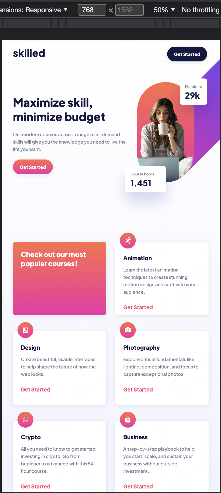

# Frontend Mentor - Skilled e-learning landing page solution

This is a solution to the [Skilled e-learning landing page challenge on Frontend Mentor](https://www.frontendmentor.io/challenges/skilled-elearning-landing-page-S1ObDrZ8q). Frontend Mentor challenges help you improve your coding skills by building realistic projects.

## Table of contents

- [Overview](#overview)
  - [The challenge](#the-challenge)
  - [Screenshot](#screenshot)
  - [Links](#links)
- [My process](#my-process)
  - [Built with](#built-with)
  - [What I learned](#what-i-learned)
  - [Continued development](#continued-development)
  - [Useful resources](#useful-resources)
- [Author](#author)
- [Acknowledgments](#acknowledgments)

## Overview

### The challenge

Users should be able to:

- View the optimal layout depending on their device's screen size
- See hover states for interactive elements

### Screenshot

### Links

- [Solution URL:](https://www.frontendmentor.io/solutions/project-done-with-reactjs-and-sass-xvqAhGrJI7)
- [Live Site URL:](https://skilled-e-learning.vercel.app/)

## My process

### Built with

- Semantic HTML5 markup
- CSS custom properties
- CSS Grid
- Mobile-first workflow
- [React](https://reactjs.org/) - JS library
- [Sass](https://sass-lang.com/) - For styles

### What I learned

Learnt how to use color gradient for text and polished the transform translate to move elements.

### Continued development

I am very happy with my continuous development on ReactJs and the use of picture element.
### Useful resources
-[Google](https://www.google.com/)
-[StackOverflow](https://stackoverflow.com/)
- [reactJs](https://reactjs.org/) - The documentation here is superb and also it has a large community support.
- [Responsive images](https://developer.mozilla.org/en-US/docs/Learn/HTML/Multimedia_and_embedding/Responsive_images) - This is a great explanation which helped me finally understand the image and picture elements .

## Author

- Website - [hcmwebs](https://www.hcmwebs.com)
- Frontend Mentor - [@hcmwebs](https://www.frontendmentor.io/profile/hcmwebs)
- Twitter - [@hcmwebs](https://www.twitter.com/hcmwebs)

## Acknowledgments
[Frontend](https://www.frontendmentor.io) -  Thank you very much for offering such a great platform.
